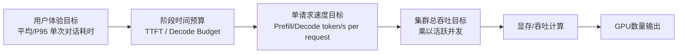

# 大模型推理 GPU 资源计算原理

---

## GPU 卡数计算原则

在大模型在线推理场景下，GPU 部署规模的测算本质上属于**多资源约束下的容量规划问题**。最终所需 GPU 卡数，不应采用“先根据显存估算最小卡数，再对吞吐和时延进行补充校验”的串行方式确定，而应基于各类关键约束分别建模后统一求解。

具体而言，模型部署规模至少同时受到以下几类约束影响：

* **显存约束**：用于保证模型权重、运行时缓存、KV Cache 及必要的系统开销能够被稳定承载；
* **Prefill 吞吐约束**：用于保证输入侧 token 处理能力满足首 token 返回时间及输入阶段时延目标；
* **Decode 吞吐约束**：用于保证输出侧 token 生成能力满足整体生成时延与并发服务目标。

因此，计算过程中应分别基于上述约束，独立求得各自对应的最小 GPU 数量，并将其视为系统在该约束下的资源下界。最终业务最小可行部署规模应取各约束结果中的最大值，即：

**最终所需 GPU 卡数 = max(显存约束卡数, Prefill 吞吐约束卡数, Decode 吞吐约束卡数)**

该计算逻辑能够准确反映在线推理系统“任一关键约束不满足，则整体方案不可行”的基本特征，因而更符合容量规划的数学定义与工程实践。

相较之下，“先按显存估算最小卡数，再校验吞吐是否满足”的方式，可以作为工程实现中的简化求解流程，用于帮助快速判断模型是否具备基本可部署性；但从方法论上看，其本质是对多约束问题的顺序试探，不能完整表达显存、Prefill 吞吐、Decode 吞吐在资源规划中的同级约束关系。因此，在正式技术方案中，建议采用“**分别建模、统一取最大值**”的计算原则，作为 GPU 卡数测算的标准方法。

在得到业务最小可行卡数后，还应进一步结合高可用要求、资源冗余、安全水位、调度损耗以及未来业务增长预留，形成最终推荐部署规模。

---

## 1. 目标

本文档用于大模型在线推理场景下的 GPU 资源估算，输出：

* 显存约束卡数
* decode 吞吐约束卡数
* prefill 吞吐约束卡数
* 高可用后的最终 GPU 数量

支持：

* Dense / MoE
* MHA / GQA / MQA / MLA / Sparse / Hybrid Attention
* 基于 GPU 厂商规格参数进行前期估算
* 基于“平均 / P95 单次对话耗时”进行用户体验建模

整体链路如下：

---

## 2. 总体计算链路

整套计算分为四层：

### 第一层：用户体验层

定义用户可感知目标：

* P95 首 token 延迟 `TTFT`
* 平均单次对话总耗时
* P95 单次对话总耗时
* 峰值并发 `Peak Concurrency`
* 输入 / 输出长度分布

### 第二层：单请求速度层

将时延目标转换为：

* 单请求 prefill 速度目标 `R_prefill_req`
* 单请求 decode 速度目标 `R_decode_req`

### 第三层：系统吞吐层

将单请求速度目标叠加到峰值并发，得到：

* `target_prefill_tps_total`
* `target_decode_tps_total`

这两项是系统内部资源计算约束。

### 第四层：资源层

结合模型结构、显存公式和 GPU 规格，输出：

* `G_memory`
* `G_prefill`
* `G_decode`
* `G_final`

> 说明：对外输入参数不再要求用户显式填写 `target_prefill_tps_total` 和 `target_decode_tps_total`。这两个量作为系统内部推导结果保留，用于与底层 GPU 估算公式对接。

---

## 3. 输入参数

### 3.1 模型参数

| 参数                                    | 含义                                      |
| ------------------------------------- | --------------------------------------- |
| `arch_family`                         | Dense / MoE                             |
| `attention_type`                      | MHA / GQA / MQA / MLA / Sparse / Hybrid |
| `total_params_b`                      | 总参数量，单位 B                               |
| `activated_params_per_token_b`        | 每 token 激活参数量，单位 B，MoE 使用               |
| `num_layers`                          | 层数                                      |
| `hidden_size`                         | 隐藏维度                                    |
| `num_heads`                           | Query heads 数                           |
| `num_kv_heads`                        | KV heads 数                              |
| `head_dim`                            | 每个 head 维度                              |
| `latent_cache_dim`                    | MLA latent cache 维度                     |
| `cache_aux_bytes_per_token_per_layer` | KV Cache 每个 token 的附加开销                 |
| `cache_bytes_per_token_per_layer`     | 可直接指定单 token cache 大小，覆盖推导逻辑            |

### 3.2 请求参数

| 参数                        | 含义                        |
| ------------------------- | ------------------------- |
| `concurrency`             | 当前估算场景下的同时活跃请求数           |
| `batch_size_per_request`  | 单个请求的 Batch Size，默认 1     |
| `request_shapes`          | 请求长度分布                    |
| `target_peak_concurrency` | 峰值并发                      |
| `decode_active_ratio`     | 峰值并发中处于 decode 阶段的活跃比例，可选 |

其中 `request_shapes` 至少包含：

* 请求类型
* 占比
* 平均输入长度
* 平均输出长度

### 3.3 用户体验参数

| 参数                         | 含义                    |
| -------------------------- | --------------------- |
| `target_ttft_p95_sec`      | P95 首 token 延迟目标      |
| `target_e2e_avg_sec`       | 平均单次对话总耗时目标           |
| `target_e2e_p95_sec`       | P95 单次对话总耗时目标         |
| `target_input_tokens_avg`  | 平均输入长度                |
| `target_input_tokens_p95`  | P95 输入长度              |
| `target_output_tokens_avg` | 平均输出长度                |
| `target_output_tokens_p95` | P95 输出长度              |
| `target_ttft_avg_sec`      | 平均 TTFT 目标，可选         |
| `prefill_time_share_avg`   | 平均场景下 prefill 耗时占比，可选 |

> 说明：
>
> * 对外默认使用“平均 / P95 单次对话耗时”作为主要输入口径。
> * 若未显式传入 `target_ttft_avg_sec`，系统可使用 `prefill_time_share_avg × target_e2e_avg_sec` 自动估算平均 prefill 时间预算。

### 3.4 GPU 参数

| 参数                            | 含义                 |
| ----------------------------- | ------------------ |
| `gpu_name`                    | GPU 名称             |
| `vram_gb`                     | 显存容量，单位 GB         |
| `memory_bandwidth_gb_per_sec` | 显存带宽，单位 GB/s       |
| `fp32_tflops`                 | FP32 算力            |
| `fp16_tflops`                 | FP16 算力            |
| `bf16_tflops`                 | BF16 算力            |
| `fp8_tflops`                  | FP8 算力             |
| `int8_tflops`                 | INT8 算力            |
| `int4_tflops`                 | INT4 算力 / W4A16 算力 |

### 3.5 高可用参数

| 参数                       | 含义                                               |
| ------------------------ | ------------------------------------------------ |
| `ha_mode`                | none / n_plus_1 / active_standby / active_active |
| `replica_count`          | 多活副本数                                            |
| `failover_reserve_ratio` | 故障冗余比例                                           |

### 3.6 运行时参数（Runtime Config）

这类参数不属于特定 LLM 的模型结构或某一张显卡白皮书，而主要取决于推理引擎（如 vLLM / SGLang）、量化方案以及系统安全边际策略。虽然在当前 Python `dataclasses` 中它们可能被挂在模型或显卡类下，但在规划时应作为独立的全局变量配置。

| 参数                            | 挂载对象 | 含义                                                     |
| ----------------------------- | ---- | ------------------------------------------------------ |
| `inference_precision`         | 模型配置 | 推理精度；权重字节数与主算力口径由此决定                                   |
| `kv_cache_dtype`              | 模型配置 | KV Cache 的数据存储格式                                       |
| `weight_overhead_ratio`       | 模型配置 | 模型权重显存膨胀的冗余比例，默认 0.15                                  |
| `runtime_overhead_ratio`      | 模型配置 | 运行时上下文等占模型的比例，默认 0.08                                  |
| `runtime_overhead_gb`         | 模型配置 | 基础运行时保底显存绝对值，用于 CUDA Context / NCCL 等静态开销，单位 GB，默认 2.0 |
| `usable_vram_ratio`           | 显卡配置 | 防 OOM 的安全可用显存比例，默认 0.90                                |
| `decode_efficiency`           | 显卡配置 | Decode 阶段基于硬件规格打底的理论折减系数（基于 MBU），默认 0.40               |
| `prefill_efficiency`          | 显卡配置 | Prefill 阶段基于硬件规格打底的理论折减系数（基于 MFU），默认 0.55              |
| `compute_efficiency`          | 显卡配置 | 极限发热 / 功耗墙等导致的峰值算力折减系数，默认 0.60                         |
| `prefill_memory_reuse_factor` | 显卡配置 | Prefill 阶段批处理时显存带宽的虚拟读取放大倍率，默认 24.0                    |
| `framework`                   | 运行环境 | 推理引擎选择（vLLM / SGLang）                                  |
| `prefix_cache_hit_rate`       | 运行环境 | 前缀缓存命中率，降低 Prefill 耗时                                  |

### 3.7 兼容参数（专家模式）

为兼容旧版接口或专家用户手动覆盖，仍可保留以下内部参数作为可选输入：

| 参数                         | 含义                     |
| -------------------------- | ---------------------- |
| `target_prefill_tps_total` | 系统总 prefill token/s 目标 |
| `target_decode_tps_total`  | 系统总 decode token/s 目标  |

若这两个参数被显式传入，则系统可跳过第 4 节的自动推导，直接进入第 7 节吞吐约束卡数计算。

---

## 4. 用户体验指标到系统指标的映射

这一层的目标，是把用户能直接感知的体验指标，转换成系统容量规划可直接使用的 token/s 目标。

可按三步理解：

1. 先把单次对话总耗时拆成 prefill 阶段和 decode 阶段。
2. 再分别换算为单请求 prefill / decode 速度目标。
3. 最后结合活跃并发，得到系统总吞吐目标 `target_prefill_tps_total` 与 `target_decode_tps_total`。

其中：

* `prefill` 处理输入 prompt，对应首 token 延迟 `TTFT`
* `decode` 持续生成输出 token，对应流式生成速度 `Streaming Speed`

### 4.1 基本定义

首 token 延迟 (TTFT)：

$$
TTFT = t_{first_token} - t_{request}
$$

TTFT 主要受 prefill 能力影响。

端到端单次对话时延：

$$
Latency_{e2e} = t_{last_token} - t_{request}
$$

近似拆解为：

$$
Latency_{e2e} \approx T_{prefill} + T_{decode}
$$

其中：

$$
T_{prefill} \approx TTFT
$$

$$
T_{decode} \approx \frac{S_{out}}{R_{decode,req}}
$$

这个拆法更贴近用户感知，因为用户实际能感觉到的是：

* 第一个 token 多久出来
* 后续输出多久生成完

### 4.2 平均场景的时间预算

对于平均场景，设：

* 平均输入长度为 $S_{in,avg}$
* 平均输出长度为 $S_{out,avg}$
* 平均单次对话总耗时目标为 $T_{e2e,avg}$

若提供平均 TTFT 目标 `target_ttft_avg_sec`，则：

$$
T_{prefill,avg} = target_ttft_avg_sec
$$

$$
T_{decode,avg} = target_e2e_avg_sec - target_ttft_avg_sec
$$

若未提供平均 TTFT 目标，则用平均 prefill 耗时占比估算：

$$
T_{prefill,avg} = prefill_time_share_avg \times target_e2e_avg_sec
$$

$$
T_{decode,avg} = target_e2e_avg_sec - T_{prefill,avg}
$$

### 4.3 P95 场景的时间预算

对于 P95 场景，设：

* P95 输入长度为 $S_{in,p95}$
* P95 输出长度为 $S_{out,p95}$
* P95 单次对话总耗时目标为 $T_{e2e,p95}$
* P95 TTFT 目标为 $T_{ttft,p95}$

则：

$$
T_{prefill,p95} \approx T_{ttft,p95} = target\_ttft\_p95\_sec
$$

$$
T_{decode,p95} = target\_e2e\_p95\_sec - target\_ttft\_p95\_sec
$$

含义是：

* 在峰值时刻，系统需要同时完成约 `C_peak` 个请求的 prompt 处理
* 每个请求按保守口径使用 `S_in,p95` 作为输入 token 规模
* 这些 token 需要在 `T_prefill_budget` 时间内被处理完成

因此：

* 分子 `C_peak x S_in,p95` 表示高峰时刻需要处理的总输入 token 量
* 分母 `T_prefill_budget` 表示允许系统完成这些 prefill 工作的时间预算
* 两者相除后，得到系统需要具备的总 prefill 吞吐能力

工程上通常可将 `T_prefill_budget` 视为 TTFT 预算中主要由 prefill 消耗的那部分时间，因此它通常不应大于 `target_ttft_p95_sec`。

工程上需要保证：

$$
T_{decode,p95} > 0
$$

若 `target_e2e_p95_sec <= target_ttft_p95_sec`，则参数本身不成立，应直接报错或提示用户修正。

### 4.4 从时间预算推导单请求速度目标

#### 平均场景

Prefill 单请求目标速度：

$$
R_{prefill,req}^{avg} = \frac{S_{in,avg}}{T_{prefill,avg}}
$$

Decode 单请求目标速度：

$$
R_{decode,req}^{avg} = \frac{S_{out,avg}}{T_{decode,avg}}
$$

#### P95 场景

Prefill 单请求目标速度：

$$
R_{prefill,req}^{p95} = \frac{S_{in,p95}}{T_{prefill,p95}}
$$

Decode 单请求目标速度：

$$
R_{decode,req}^{p95} = \frac{S_{out,p95}}{T_{decode,p95}}
$$

### 4.5 从单请求速度目标推导系统总吞吐目标

设：

* 峰值并发为 $C_{peak}$
* 同时处于 decode 阶段的活跃比例为 $r_{decode_active}$

则 decode 活跃请求数为：

$$
C_{decode} = C_{peak} \times r_{decode_active}
$$

#### 系统总 prefill 吞吐目标

保守起见，prefill 吞吐一般按峰值并发同时触发估计：

$$
target\_prefill\_tps\_total = C_{peak} \times R_{prefill,req}^{p95}
$$

代入得：

$$
target\_prefill\_tps\_total \approx \frac{C_{peak} \times S_{in,p95}}{T_{prefill,p95}}
$$

#### 系统总 decode 吞吐目标

Decode 吞吐按活跃生成请求估计：

$$
target\_decode\_tps\_total = C_{decode} \times R_{decode,req}^{p95}
$$

代入得：

$$
target\_decode\_tps\_total \approx \frac{C_{peak} \times r_{decode\_active} \times S_{out,p95}}{T_{decode,p95}}
$$

### 4.6 端到端时延校验

系统推导完成后，可反向校验：

$$
Latency_{e2e}^{avg} \approx \frac{S_{in,avg}}{R_{prefill,req}^{avg}} + \frac{S_{out,avg}}{R_{decode,req}^{avg}}
$$

$$
Latency_{e2e}^{p95} \approx \frac{S_{in,p95}}{R_{prefill,req}^{p95}} + \frac{S_{out,p95}}{R_{decode,req}^{p95}}
$$

这一步的作用是验证：由“用户耗时目标”自动推导出来的内部吞吐要求，是否与预期体验一致。

### 4.7 示例

设：

* 峰值并发 `C_peak = 200`
* decode 活跃比例 `r_decode_active = 0.6`
* P95 输入长度 `S_in,p95 = 4000`
* P95 输出长度 `S_out,p95 = 260`
* P95 首 token 耗时目标 `T_ttft,p95 = 2s`
* P95 单次对话总耗时目标 `T_e2e,p95 = 15s`

则：

$$
T_{prefill,p95} = 2s
$$

$$
T_{decode,p95} = 15 - 2 = 13s
$$

Prefill 单请求目标速度：

$$
R_{prefill,req}^{p95} = \frac{4000}{2} = 2000\ token/s
$$

Decode 单请求目标速度：

$$
R_{decode,req}^{p95} = \frac{260}{13} = 20\ token/s
$$

Decode 活跃请求数：

$$
C_{decode} = 200 \times 0.6 = 120
$$

系统总 prefill 吞吐目标：

$$
target_prefill_tps_total = 200 \times 2000 = 400000\ token/s
$$

系统总 decode 吞吐目标：

$$
target_decode_tps_total = 120 \times 20 = 2400\ token/s
$$

这两个量随后进入后续的 `G_prefill` 和 `G_decode` 计算，最终与显存约束一起决定 GPU 数量。

---

## 5. 显存计算

### 5.1 总显存公式

$$
M_{total} \approx M_{weights} + M_{cache} + M_{runtime}
$$

---

### 5.2 权重显存

$$
M_{weights,raw}^{GB} = total\_params\_b \times bytes(inference\_precision)
$$

考虑附加开销：

$$
M_{weights} = M_{weights,raw}^{GB} \times (1 + r_{weight})
$$

其中：

$$
r_{weight} = 10%\sim20%
$$

---

### 5.3 Cache 显存统一公式

$$
M_{cache} \approx num\_layers \times seq\_len \times batch \times E_{cache/token/layer}
$$

其中：

$$
seq\_len = input\_len + output\_len
$$

---

### 5.4 不同架构的 Cache 计算

#### MHA

$$
E_{cache/token/layer}^{MHA} \approx 2 \times num\_heads \times head\_dim \times cache\_dtype\_bytes
$$

$$
M_{cache}^{MHA}
\approx
\frac{num\_layers \times seq\_len \times batch \times 2 \times num\_heads \times head\_dim \times cache\_dtype\_bytes}{10^9}
$$

若：

$$
hidden\_size = num\_heads \times head\_dim
$$

则可简化为：

$$
M_{cache}^{MHA}
\approx
\frac{2 \times num\_layers \times seq\_len \times hidden\_size \times batch \times cache\_dtype\_bytes}{10^9}
$$

#### GQA

$$
E_{cache/token/layer}^{GQA} \approx 2 \times num\_kv\_heads \times head\_dim \times cache\_dtype\_bytes
$$

$$
M_{cache}^{GQA}
\approx
\frac{2 \times num\_layers \times seq\_len \times num\_kv\_heads \times head\_dim \times batch \times cache\_dtype\_bytes}{10^9}
$$

#### MQA

$$
E_{cache/token/layer}^{MQA} \approx 2 \times head\_dim \times cache\_dtype\_bytes
$$

$$
M_{cache}^{MQA}
\approx
\frac{2 \times num\_layers \times seq\_len \times head\_dim \times batch \times cache\_dtype\_bytes}{10^9}
$$

#### MLA

$$
E_{cache/token/layer}^{MLA}
\approx
latent\_cache\_dim \times cache\_dtype\_bytes + E_{aux}
$$

$$
M_{cache}^{MLA}
\approx
\frac{num\_layers \times seq\_len \times batch \times (latent\_cache\_dim \times cache\_dtype\_bytes + E_{aux})}{10^9}
$$

#### Sparse / Hybrid Attention

$$
M_{cache}^{Sparse} = \text{按真实缓存结构计算}
$$

---

### 5.5 运行时开销

$$
M_{runtime} = M_{workspace} + M_{system}
$$

可采用：

#### 固定值法

$$
M_{runtime} = 2 \sim 8\ \text{GB}
$$

#### 比例法

$$
M_{runtime} = r_{runtime} \times M_{weights}
$$

其中：

$$
r_{runtime} = 5%\sim20%
$$

稳妥写法：

$$
M_{runtime} = \max(M_{runtime,fixed},\ r_{runtime}\times M_{weights})
$$

#### 理论与实践来源：
1. **$M_{runtime,fixed}$ (保底值)**：对应基础设施开销。
   - **CUDA Context & Libraries**: 初始化 GPU 时，CUDA Driver 建立 Context 约占 **300 MB - 800 MB**。加载 cuBLAS、cuDNN、NCCL 等库及其 Workspace 进一步增加开销。
   - **引擎静态驻留**: 推理引擎（如 vLLM/SGLang）自身在管理面的内存对象、HTTP 服务状态等。
   - **结论**: 在 7B 等小模型上，静态底噪占比显著，故设 **2.0 GB** 作为物理下限（Floor Value）。
2. **$r_{runtime}$ (运行时比例)**：对应模型相关开销。
   - **CUDA Graphs (算子图捕获)**: 推理引擎默认通过预捕获算子执行流并预分配张量池（Static Buffer）来提升速度。该缓冲区大小与模型层数、宽度和配置的 Max Token Length 呈正相关。
   - **Activation Memory**: 推理前向计算中产生的中间激活张量。虽然推理时会释放，但在高性能模式下常被提前锁定。
   - **结论**: 业界（如 NVIDIA TensorRT-LLM 或 Meta Llama 实践指南）通常建议预留模型权重的 **5% - 15%** 应对动态抖动。本工具中 vLLM 取中性值 **8%**。
   - **SGLang**: 相比 vLLM，因需维护 **RadixTree (前缀缓存树)** 的元数据索引节点，其管理面开销随缓存深度略微增长，故建议将 $r_{runtime}$ 提升至 **10%**。

> [!NOTE]
> **运行时开销与安全水位线的区别**：运行时开销是推理框架**内部**为了高性能而必须预占用的“账面支出”（如算子图）；而下方 5.7 节提到的“安全水位线”是预留给**框架外部**系统环境（驱动、监控、碎片）的“生命保险”。两者处于不同维度，不可完全合并。

---

### 5.6 平均显存与 P95 显存

#### 平均场景

$$
M_{total}^{avg} = M_{weights} + concurrency \times M_{cache}(E[S]) + M_{runtime}
$$

#### P95 场景

$$
M_{total}^{p95} = M_{weights} + concurrency \times M_{cache}(S_{p95}) + M_{runtime}
$$

采购 sizing 建议采用：

$$
M_{sizing} = M_{total}^{p95}
$$

---

### 5.7 单卡可用显存与显存约束卡数

$$
M_{usable}^{GB} = vram\_gb \times r_{usable}
$$

其中：

$$
r_{usable} = 0.85\sim0.92
$$

若需统一：

$$
r_{usable} = 0.90
$$

#### 为什么需要安全水位线？
即便已经计算了“运行时开销”，依然必须保留水位线限制（对应 vLLM 参数 [`--gpu-memory-utilization`](https://docs.vllm.ai/en/latest/getting_started/engine_args.html)），其逻辑依据如下：
1. **预防“窒息”**：根据 NVIDIA Driver 架构，显存达到 100% 时，驱动层分配请求失败会导致进程被内核强杀。任何微小的异步分配（如显存监控扫描、NCCL 状态切换）都是潜在威胁。
2. **分配机制瓶颈**：vLLM 的 PagedAttention 机制在扣除权重和运行时开销后，会尝试将剩余的可用空间 **一次性全额申请** 并切分为 KV Cache 池。如果没有水位线限制，系统将没有冗余空间应对任何动态波动。
3. **隔离环境差异**：根据 vLLM 社区实践，保留 10% 冗余是应对 CUDA Context 及 Fragmented Non-torch Memory 的经典配置。

**工程准则**：
- **$M_{runtime}$ (运行时开销)**：是模型**内部**运行所需的辅助资源。
- **$r_{usable}$ (安全水位线)**：是防止物理显存**溢出**的最后一道保险。

显存约束卡数：

$$
G_{memory} = \left\lceil \frac{M_{sizing}}{M_{usable}} \right\rceil
$$

---

## 6. 请求长度分布

设共有 $K$ 类请求，第 $i$ 类请求占比为 $p_i$，满足：

$$
\sum_{i=1}^{K} p_i = 1
$$

总长度：

$$
S_i = S_{in,i} + S_{out,i}
$$

### 平均输入长度

$$
E[S_{in}] = \sum_{i=1}^{K} p_i \cdot S_{in,i}
$$

### 平均输出长度

$$
E[S_{out}] = \sum_{i=1}^{K} p_i \cdot S_{out,i}
$$

### 平均总长度

$$
E[S] = \sum_{i=1}^{K} p_i \cdot S_i
$$

### P95 输入长度

将请求按输入长度从小到大排序，累计占比达到 95% 时对应长度记为：

$$
S_{in,p95}
$$

### P95 输出长度

将请求按输出长度从小到大排序，累计占比达到 95% 时对应长度记为：

$$
S_{out,p95}
$$

### P95 总长度

将请求按总长度从小到大排序，累计占比达到 95% 时对应长度记为：

$$
S_{p95}
$$

> 建议：
>
> * 第 4 节的吞吐时间预算计算优先使用 `S_in,p95` 和 `S_out,p95`。
> * 第 5 节的显存 sizing 优先使用总长度 `S_p95`。

---

## 7. 吞吐计算

当前版本统一采用 **GPU 厂商规格推导值**，不使用实测吞吐。

### 7.1 Decode 吞吐

$$
TPS_{decode}^{spec} = \min(TPS_{decode,bandwidth},\ TPS_{decode,compute}) \times r_{decode\_eff} \times (1.15\ \text{ if SGLang})
$$

#### 理论与数据来源
1. **$r_{decode\_eff} = 0.40$ (Decode 效率 / MBU 瓶颈)**：
   - **物理本质**：Decode 阶段是典型的**内存受限（Memory-bound）**任务。每一个 Token 的生成都需要将整个模型权重从 HBM 加载到计算核心。
   - **数据偏差来源**：实际带宽利用率（Model Bandwidth Utilization, MBU）受非连续内存访问开销、指令发射延迟及存储体冲突（Bank Conflicts）影响。
   - **权威依据**: [Databricks 性能研究报告](https://www.databricks.com/blog/llm-inference-performance-engineering-best-practices)指出，生产环境下的 MBU 通常处于 **40% - 60%** 区间。本工具取保守基准值 40%。

简化为带宽主导时：

$$
TPS_{decode}^{spec}
\approx
\frac{memory\_bandwidth\_gb\_per\_sec \times 10^9 \times \eta_{decode}}{B_{decode/token}}
$$

其中：

* $B_{decode/token}$：每生成 1 个 token 的主要字节访问量
* $\eta_{decode}$：折减系数

> 💡 **架构优势洞察：**
> 引入 KV Cache 并发访存开销 ($B_{kv\_cache/step}$) 后，在长上下文 (长 $E[S]$) 且高并发场景下：
> 1. **GQA/MHA** 等传统架构的 KV Cache 访存开销会随序列长度极速攀升，导致 $TPS_{decode}^{spec}$ 严重下滑。
> 2. **MLA (DeepSeek-V3/R1、Kimi-K2.5)** 因巨幅压缩了 $E_{cache}$, 访存开销极低，此时带给集群的吞吐瓶颈大幅度减轻。
> 3. **Linear Attention (如 Qwen3.5的 Gated DeltaNet、Mamba等)** 其隐状态大小固定，不随上下文长度增加，因此在极长文本时，其吞吐几乎不衰减。

建议：

* 乐观：0.50–0.70
* 中性：0.35–0.50
* 保守：0.25–0.40

若需要算力上界：

$$
TPS_{decode,compute} = \frac{peak_compute \times \eta_{compute}}{F_{decode/token}}
$$

其中 `peak_compute` 按主计算精度选择：

* FP32：`fp32_tflops`
* FP16：`fp16_tflops`
* BF16：`bf16_tflops`
* FP8：`fp8_tflops`
* INT8：`int8_tflops`
* INT4：若未显式提供 `int4_tflops`，可降级取 `int8_tflops`

> 💡 架构优势洞察：
>
> * 在长上下文且高并发场景下，传统 GQA / MHA 的 KV Cache 访存成本会迅速增长，导致 Decode 吞吐下滑。
> * MLA 通过显著压缩 Cache 体积，可有效减轻 Decode 阶段的访存瓶颈。
> * 线性注意力类架构因隐状态大小不随上下文增长，在极长文本下吞吐衰减更轻。

---

### 7.2 Prefill 吞吐

$$
TPS_{prefill}^{spec} = \min(TPS_{prefill,compute},\ TPS_{prefill,memory}) \times r_{prefill\_eff} \times (1.10\ \text{if SGLang})
$$

#### 理论与数据来源
1. **$r_{prefill\_eff} = 0.55$ (Prefill 效率 / MFU 瓶颈)**：
   - **物理本质**：Prefill 阶段是典型的**算力受限（Compute-bound）**任务，主要处理高并行度的矩阵乘法。
   - **权威依据**: [Google PaLM 论文](https://arxiv.org/abs/2204.02311) 提出了 **MFU (Model FLOPs Utilization)** 指标。实际中，由于算子切换时间、非线性层计算以及反量化过程，硬件利用率很难达到 100%。
   - **实测性能**: [FlashAttention-2 论文](https://arxiv.org/abs/2307.08691) 指出，即便像 FlashAttention 这样极致优化的算子，其在 H100 等高端 GPU 上的实测 MFU 通常也在 **50% - 70%** 之间。本工具采用 55% 作为生产环境的稳健估算基数。

#### 算力上界

$$
TPS_{prefill,compute} = \frac{peak\_compute \times \eta_{compute}}{F_{prefill/token}}
$$

#### 带宽上界

$$
TPS_{prefill,memory} = \frac{memory\_bandwidth\_gb\_per\_sec \times 10^9 \times \eta_{bw}}{B_{prefill/token}}
$$

其中 `peak_compute` 同样按主精度选择：

* FP32：`fp32_tflops`
* FP16：`fp16_tflops`
* BF16：`bf16_tflops`
* FP8：`fp8_tflops`
* INT8：`int8_tflops`

建议折减系数：

* 乐观：0.65–0.80
* 中性：0.45–0.65
* 保守：0.30–0.45

> 💡 **访存带宽放大效应 (`prefill_memory_reuse_factor`)：**
> 在 Prefill 阶段批处理处理大量 Prompt 个 Token 时（计算密集型场景），权重加载后能在多个 Token 之间充分复用（相比 Decode 只有一个 Token）。这会使得其显存带宽等效值急剧放大，计算受限而非访存受限成为常态。在计算引擎中，通常会在 $TPS_{decode,memory}$ 的基础上乘以一个极高的放大复用因子（如默认值 `24.0`）来推断 $TPS_{prefill,memory}$，突破显存带宽的物理限制。

---

### 7.3 Dense 与 MoE 的区别

#### Dense

$$
TPOT_{compute}^{Dense} \propto total\_params
$$

#### MoE

$$
TPOT_{compute}^{MoE} \propto activated\_params\_per\_token
$$

因此：

* 显存估算看总参数
* 吞吐估算看激活参数量

---

### 7.4 吞吐约束卡数

#### Decode 约束

$$
G_{decode} = \left\lceil \frac{target\_decode\_tps\_total}{TPS_{decode}^{spec}} \right\rceil
$$

#### Prefill 约束

$$
G_{prefill} = \left\lceil \frac{target\_prefill\_tps\_total}{TPS_{prefill}^{spec}} \right\rceil
$$

#### 业务最少卡数

$$
G_{biz} = \max(G_{memory},\ G_{decode},\ G_{prefill})
$$

---

## 8. 高可用计算

### 无高可用

$$
G_{final} = G_{biz}
$$

### N+1

$$
G_{final} = G_{biz} + 1
$$

### 主备

$$
G_{final} = 2 \times G_{biz}
$$

### 多活

$$
G_{final} = replica\_count \times G_{biz}
$$

### 故障冗余

$$
G_{final}' = \left\lceil G_{final} \times (1 + failover\_reserve\_ratio) \right\rceil
$$

---

## 9. 最终输出

资源计算最终输出为：

* `G_memory`
* `G_prefill`
* `G_decode`
* `G_biz`
* `G_final`
* `TPS_decode_cluster = G_biz × TPS_decode_per_gpu`
* `TPS_prefill_cluster = G_biz × TPS_prefill_per_gpu`
* `DailyDecodeTokensMax = TPS_decode_cluster × 86400`
* `DailyPrefillTokensMax = TPS_prefill_cluster × 86400`
* `AvgConversationDurationSec`
* `P95ConversationDurationSec`
* `DerivedTargetPrefillTPS`
* `DerivedTargetDecodeTPS`
* `PrefillReqRateAvg/P95`
* `DecodeReqRateAvg/P95`

其中：

$$
G_{biz} = \max(G_{memory}, G_{prefill}, G_{decode})
$$

$$
G_{final} = G_{biz} + G_{HA}
$$

### 9.1 每日 token 上限

每日 token 上限建议按业务基线卡数 `G_biz` 计算，而不是按 `G_final` 计算。原因是 `G_final` 中的 HA 冗余卡在主备、N+1 等模式下并不等价于新增可售卖产能；若直接按采购总卡数折算，会高估系统每日可供给 token。

### 9.2 平均一次对话耗时估算

平均一次对话耗时建议按 `G_biz` 口径估算，并采用近似拆解：

$$
AvgConversationDurationSec
\approx
\frac{avg\_input\_tokens}{TPS_{prefill\_cluster} / concurrency}
+
\frac{avg\_output\_tokens}{TPS_{decode\_cluster} / concurrency}
$$

### 9.3 P95 一次对话耗时估算

P95 一次对话耗时可近似校验为：

$$
P95ConversationDurationSec
\approx
\frac{p95\_input\_tokens}{TPS_{prefill\_cluster} / target\_peak\_concurrency}
+
\frac{p95\_output\_tokens}{TPS_{decode\_cluster} / (target\_peak\_concurrency \times decode\_active\_ratio)}
$$

这两个值是容量规划近似值，用于快速判断“在这组卡数下，大致一轮请求要多久”，不等价于线上严格的 P95 / P99 时延承诺。

### 9.4 过程明细输出建议

为了便于校验，工程输出建议同时附带“计算过程”明细，至少覆盖以下五组信息：

* 请求画像统计：`avg_input_tokens`、`avg_output_tokens`、`p95_input_tokens`、`p95_output_tokens`、`p95_total_tokens`
* 时间预算推导：`T_prefill_avg`、`T_decode_avg`、`T_prefill_p95`、`T_decode_p95`
* 速度目标推导：`R_prefill_req_avg/p95`、`R_decode_req_avg/p95`、`DerivedTargetPrefillTPS`、`DerivedTargetDecodeTPS`
* 显存估算：权重显存、KV Cache、运行时开销、`G_memory`
* 吞吐估算与最终结果：带宽受限 / 算力受限吞吐、`G_decode`、`G_prefill`、`G_biz`、`G_final`、每日 token 上限、平均 / P95 单次对话耗时

每个条目都应包含三部分：

* 公式名
* 代入值
* 结果值

---

## 10. 推理框架建模（vLLM vs SGLang）

不同的推理框架在调度算法、算子实现及显存管理上存在差异，这些差异直接影响容量规划的准确性。

### 10.1 vLLM（基准）

* **PagedAttention**：几乎消除显存碎片，利用率高。
* **性能特征**：工业界最通用的吞吐基准（Baseline）。

### 10.2 SGLang（高性能增强）

* **FlashInfer**：相比 vLLM 默认 Kernel，SGLang 往往能获得更高的算力利用率。

  * **建模**：算力效率乘以 `1.10` 加成。
* **RadixAttention（前缀缓存）**：

  * **时间收益**：缓存命中的输入 token 片段不再需要重新计算。
  * **建模**：Prefill 有效输入 token 可按 `avg_input_tokens × (1 - cache_hit_rate)` 下降。
  * **空间代偿**：维护前序树元数据节点需要额外显存开销。
  * **建模**：`runtime_overhead_ratio` 可额外增加 `2%`。
* **调度优化**：SGLang 的 Continuous Batching 在 Batch 填充率和切换开销上更优。

  * **建模**：Decode 效率乘以 `1.15` 加成。

### 10.3 参数映射总结

| 框架     | 算力利用率加成  | Decode 调度加成 | 额外 vRAM 开销 | 前缀缓存支持      |
| ------ | -------- | ----------- | ---------- | ----------- |
| vLLM   | 1.00（基准） | 1.00（基准）    | 0%         | 有限（默认 0%）   |
| SGLang | 1.10     | 1.15        | +2%        | 原生（默认 20%+） |

在该 Sizing 工具中，切换引擎会动态调整上述底层系数，从而更真实地反映上线后的资源水位。

---

## 11. 设计原则总结

### 11.1 对外口径优先用“用户时延”而不是“系统 TPS”

业务方最容易理解的不是“系统需要多少 token/s”，而是：

* 平均一次对话要多久
* P95 最慢要多久
* 首 token 多久出来

因此：

* 对外输入以“平均 / P95 单次对话耗时”表示
* 对内自动换算为 `target_prefill_tps_total` 与 `target_decode_tps_total`

### 11.2 对内口径继续保留 TPS

GPU 资源约束的核心公式仍然是吞吐和显存：

* 显存决定 `G_memory`
* Prefill 总吞吐决定 `G_prefill`
* Decode 总吞吐决定 `G_decode`

因此内部保留 TPS 口径，可以最大化复用现有代码与公式体系。

### 11.3 平均与 P95 分工不同

* 平均指标更适合评估总体用户感知与日常体验
* P95 指标更适合做资源保守规划与容量兜底

建议：

* 显存 sizing 优先按 P95 长度估算
* 吞吐目标优先按 P95 耗时预算推导
* 最终结果同时输出平均体验估算值，便于业务理解
